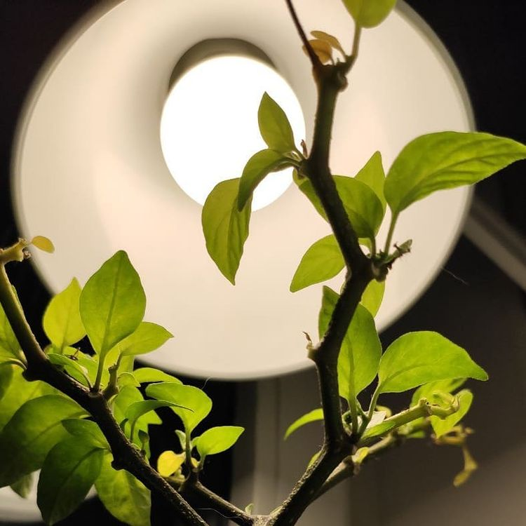
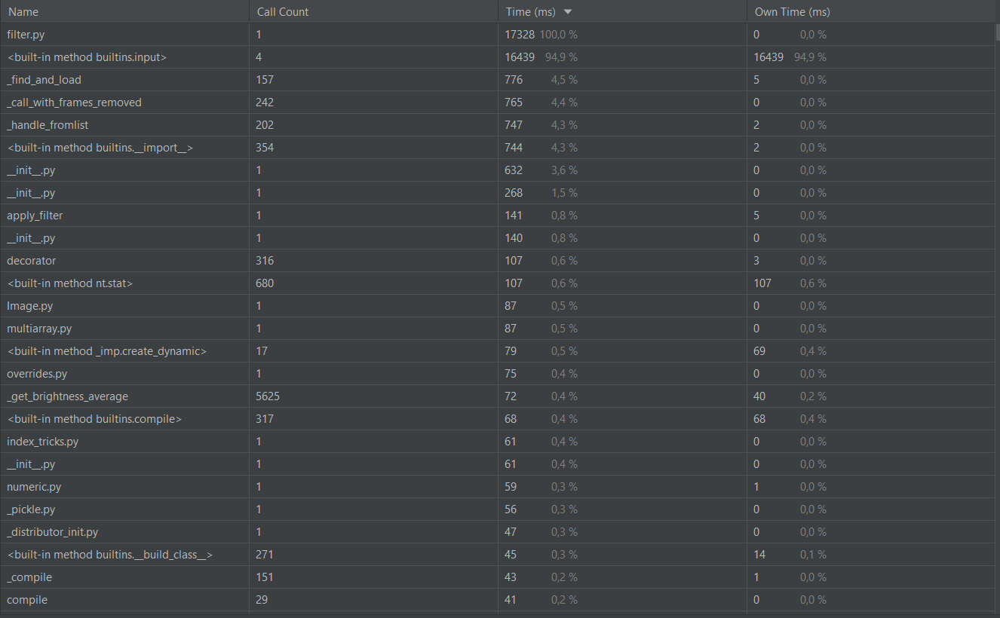
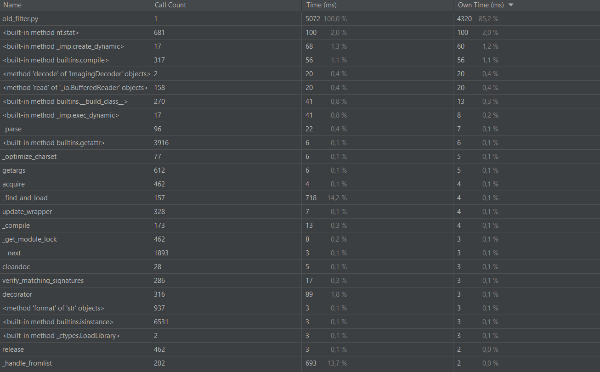
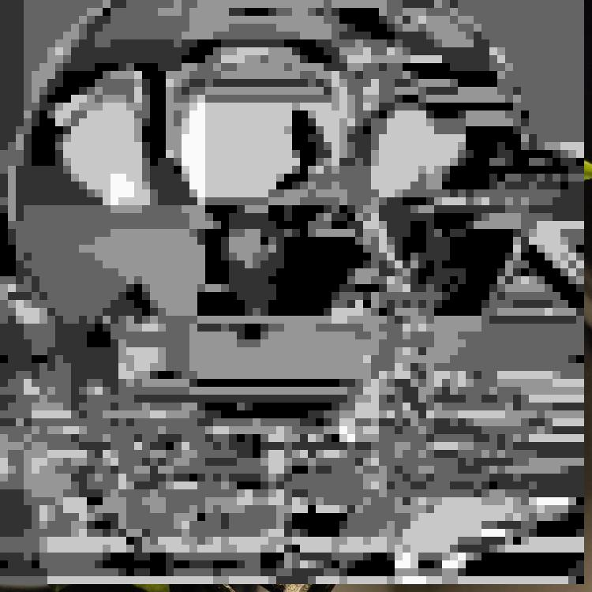
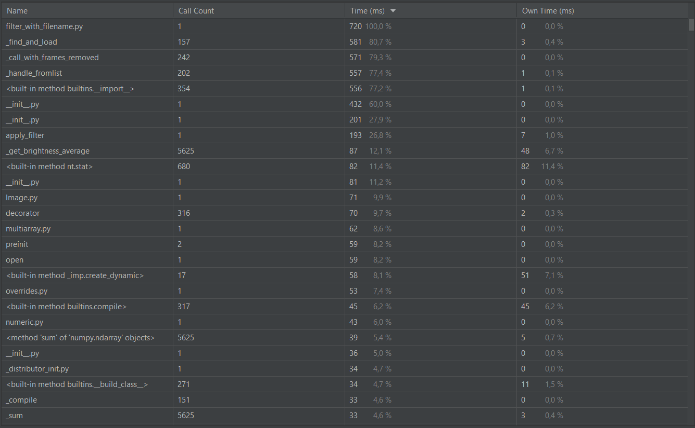
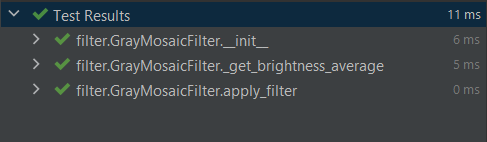
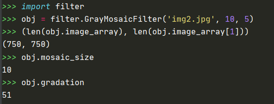

# task10_pycharm
#### Размер мозайки - 10, градаций - 5 
`255 // 5 = 51 шаг градации (для старого фильтра)`
### Исходное изображение

### filter.py

### Результат фильтра

### old_filter.py

### Результат фильтра

Не смотря на оптимизацию и внесенные правки в фильтре, профилировщик показывавет, что filter.py работает значительно 
медленнее чем old_filter.py, однако большую часть времени в filter.py занимает считывание текста с консоли. Для того, 
что бы в этом убедиться можно переписать фильтр, убрав в нем работу с консолью.

### filter_with_filename.py

Можно заменить многократное уменьшение времени работы скрипта(почти в 6 раз по сравнению с old_filter)

### Doctest

### Отладчик

